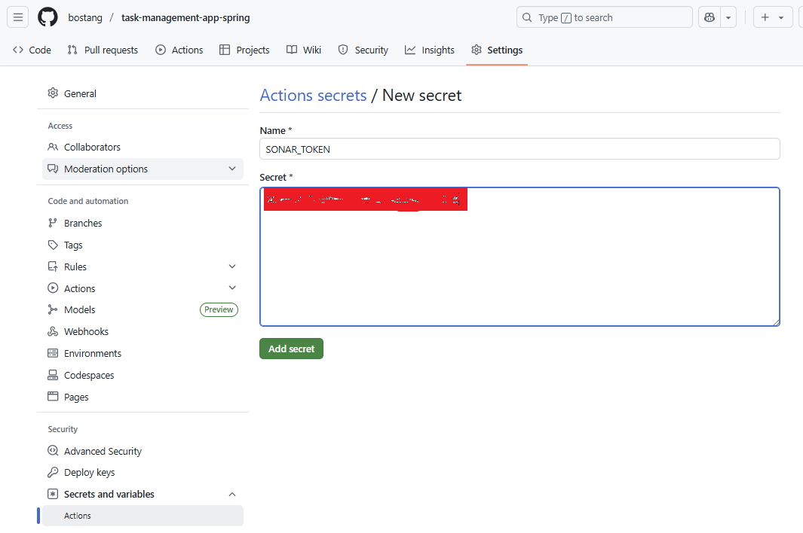

# Task Management App Spring Boot

sebuah aplikasi berbasis Java menggunakan framework `SpringBoot` untuk demonstrasi penggunaan SonarQube.

Kasus :
akan maintain kode _existing_ dengan menambahkan fitur _login_.

## Cara Menjalankan

1. Melakukan instalasi
dijalankan pertama kali untuk download library
```bash
./mvnw clean install
```

2. Jalankan
```bash
./mvnw spring-boot:run
```

1b.
```
./mvnw compile
```
tanpa melakukan unit test

3. Kirim / Test API lewat `postman`


3.1 Generate token


3.2 Validasi token


4. Maintain kode menggunakan SonarQube


Melakukan Integrasi SonarQube dengan `Github action`:


# Cara store credential di tempat yang tepat
➡️Github

sonar token ➡️ untuk akses sonarQube.

github selain menjadi repository juga sebagai secret manager.

Administration > Analysis Method


pilih **New Repository secret**




setelah build, di actions ada error apabila `dependency graph` belum di-_enable_.
